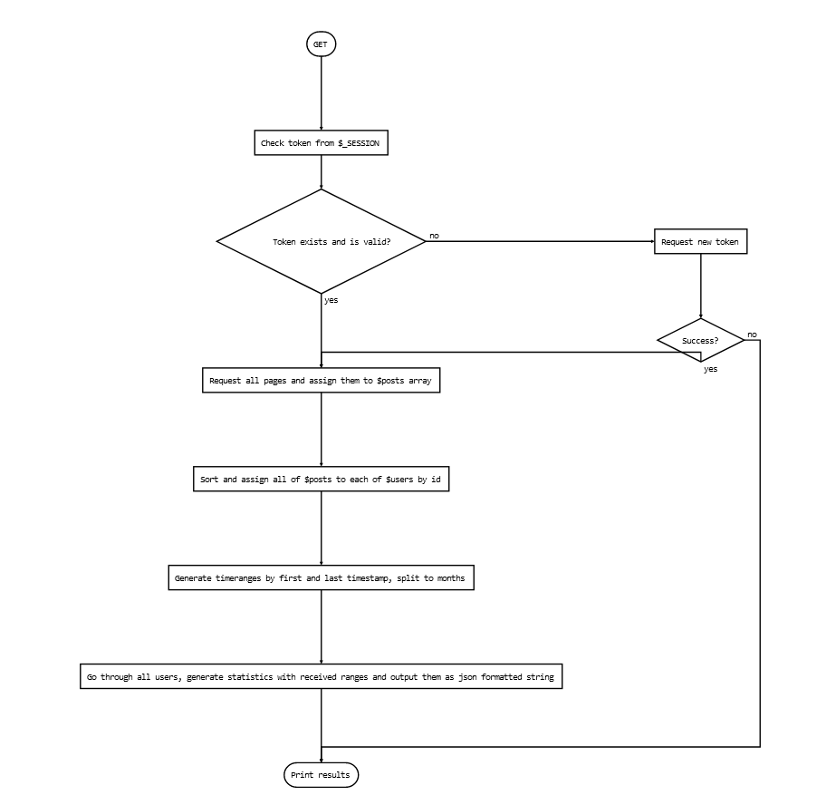

Live version available at: 
## Description
This program accesses a secured api containing a list of messages, reorganizes the received data to a user focused model, does simple statistics per user and returns the computed data in json-format.

The program first loads environment variables (listed in ./src/.env in ini-format) with **loadVars** function. It then creates a new **Connection** object and initializes it with a class function that checks if a token exists in session cache and if it's still less than an hour old. If not, a new token is requested from the api.

The queries used by both the Connection initialization and at page request are defined in **queries** source.

Once the connection object has a valid token, the program requests the messages page by page with **parseAllPagesToPost** function of **pageParser** source that returns a time sorted array of **Post** class objects. The posts array is then passed to **assignPostsToUsers** function of the same source that returns an array of **User** class objects, with posts associated with the user assigned to it as a pointer to previous posts-array.

Finally, the output is generated by creating timeranges (**Range** class, support functions in **rangeTools**) of interest and iteratively going through the users. The **User** class has a public function **buildStatistics** that generates statistics for a single user with supplied timeranges and returns user information as json formatted string. This is added to the final output, which is printed at the end of the program.

